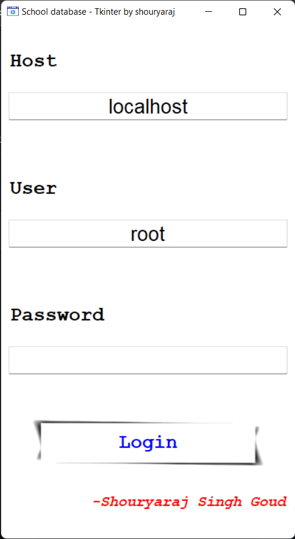
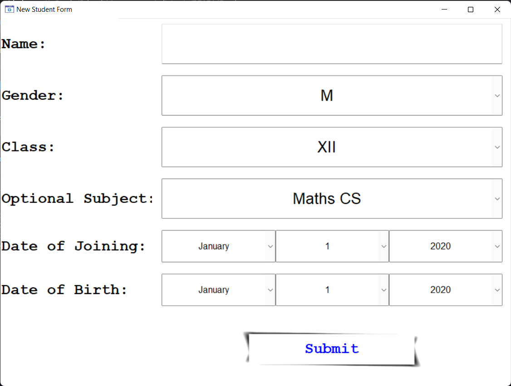

# School-Management
Project based on Tkinter for GUI and MySQL  for database. Uses procedural programming as programming paradigm

## Login Page

login uses ip address to loing to mysql server to create and operate on it.

## Admission Form

Admission form prompts every necessary details to register student into database
